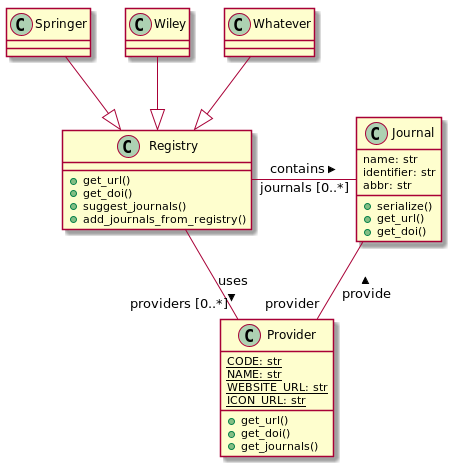

===
API
===

Someone in my CS lecture told me I should always add an UML diagram, so here it is:

    UML diagram of the classes used in this project.

Journals
--------

.. automodule:: goto_publication.journal
    :members:
    :undoc-members:

Providers
---------

.. autoclass:: goto_publication.providers.Provider
    :members:
    :undoc-members:

For detailed info on the different providers, `checks the detailed page <api-providers.html>`_

Registry
--------

.. automodule:: goto_publication.registry
    :members:
    :undoc-members:

